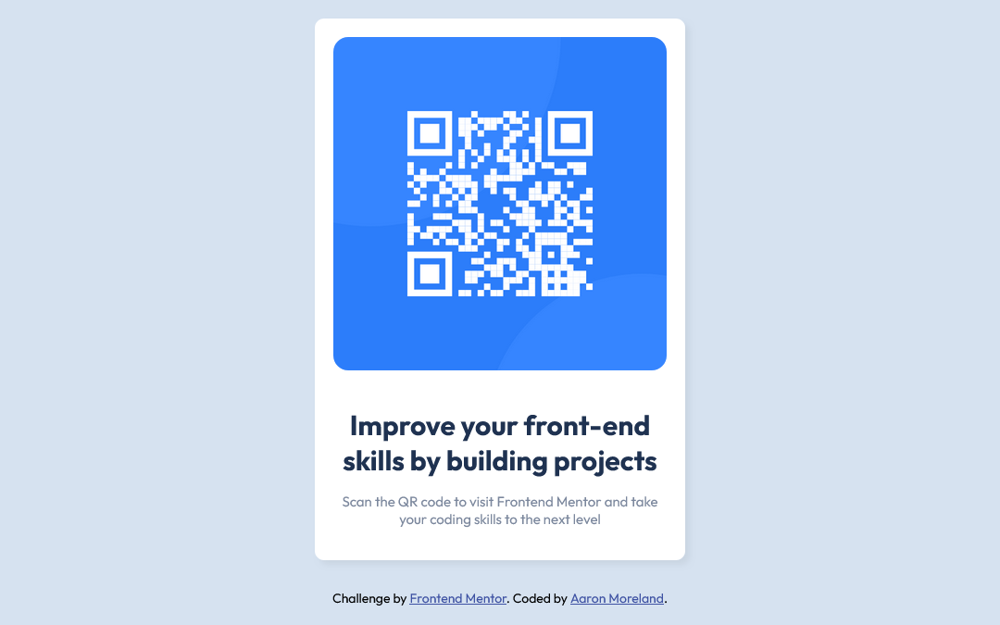

# Frontend Mentor - QR code component solution

This is a solution to the [QR code component challenge on Frontend Mentor](https://www.frontendmentor.io/challenges/qr-code-component-iux_sIO_H). Frontend Mentor challenges help you improve your coding skills by building realistic projects. 

## Table of contents

- [Overview](#overview)
  - [Screenshot](#screenshot)
  - [Links](#links)
- [My process](#my-process)
  - [Built with](#built-with)
  - [What I learned](#what-i-learned)
  - [Continued development](#continued-development)
  - [Useful resources](#useful-resources)
- [Author](#author)
- [Acknowledgments](#acknowledgments)

**Note: Delete this note and update the table of contents based on what sections you keep.**

## Overview

### Screenshot

## My process

### Built with

- Semantic HTML5 markup
- CSS custom properties
- Flexbox
- CSS Grid

### What I learned

I think the most I took from doing this QR Code challenge has probably been the use of CSS to shape it. Since I am fairly new to HTML and CSS in general it has been nice to be able to work on and use some things I haven't used before such as box-shadow and really uploading all of this to GitHub. I am still trying to remember the basic commands to upload everything to Github. All of this is good practice. I think styling it in CSS has also been a challenge, trying to remember how exactly to move what I want to place said item( in this case in the center). This challenge made me realize that I have a long way to go to be in the spot I want to be.

### Continued development

I am going to continue doing side projects through frontend mentor as I really enjoyed this project. I am also going to be doing my own t-shirt website and will be trying to do it through react.js. Hoping to add a bunch of projects to my e-portfolio that I have also created. 

### Useful resources
Using https://www.w3schools.com/css/default.asp has helped me alot to either reassure me that I am typing/using the correct things to style and if I didn't know how to style it. I found box-shadowing on here and used that as a guide.

## Final Words

This has been eye opening to me and seeing where I stand even though I know it is a simple project of a QR code. I have a long way to go and im excited to continue doing projects and seeing my progression. If you are reading this and would like to make any suggestions or feedback. Feel free to contact me via email at a11daaron@gmail.com. Thank you again if you made it through this far.

